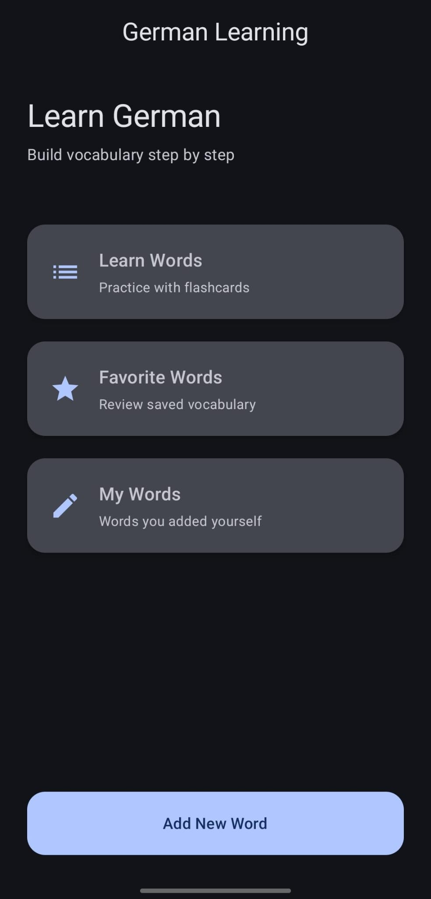
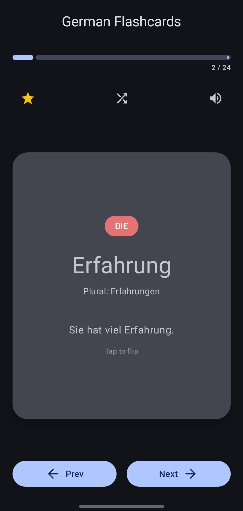
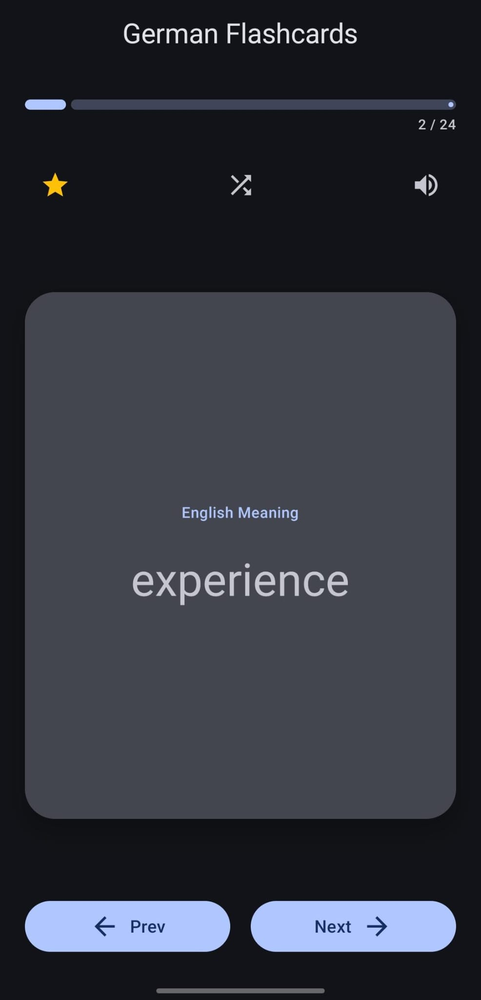
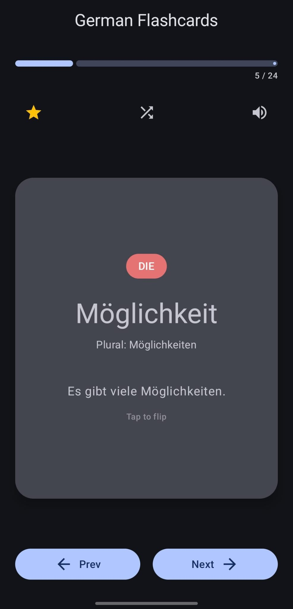
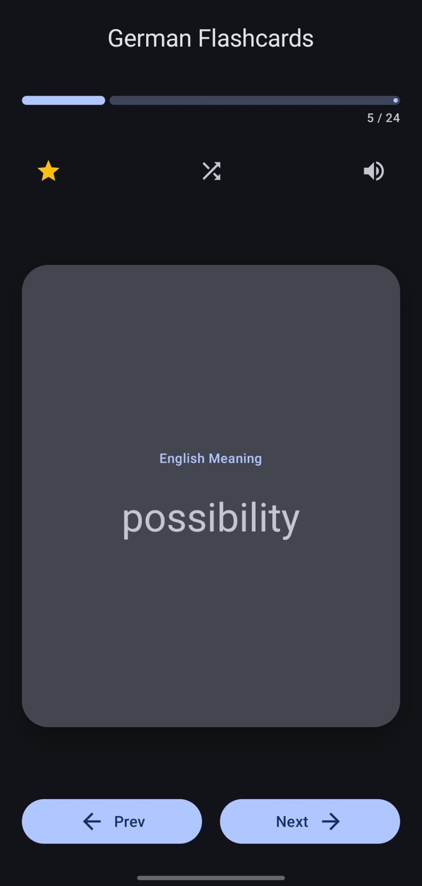
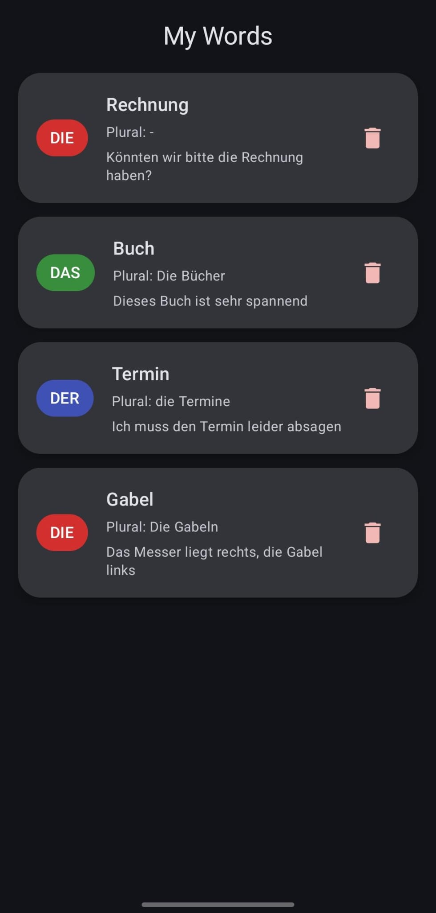

## Smart German Vocabulary Trainer

Android application designed to help learners improve their German vocabulary using **color-coded articles** and **interactive flashcards**.

### ✨ Features

* Color-coded German articles (*der, die, das*) to support faster memorization
* Flashcard-based vocabulary practice
* Clean and user-friendly interface

### 🛠 Technologies

* **Kotlin**
* **Jetpack Compose**
* **Android Studio**

### 👨‍💻 Author

**Hasan Turhan**
## 📸 Screenshots

### Home Screen

### Flashcard Learning

### Another Example

### My Words

